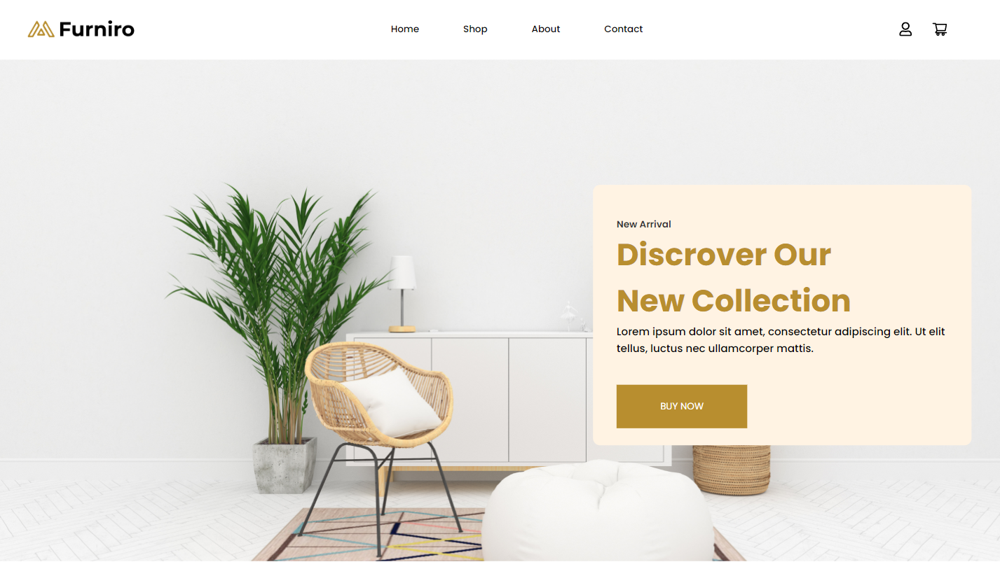

# Visão Geral
Furniro é uma aplicação desenvolvida para oferecer vendas de móveis online. A aplicação apresenta uma interface amigável, com recursos interativos para melhorar a experiência do usuário.

# Tecnologias
O projeto foi desenvolvido com ReactTS + Vite e Tailwindcss, utilizada a api [Firebase](https://firebase.google.com/docs/auth?hl=pt-br) para autenticação do usuário, [ViaCep](https://viacep.com.br/) para preencher campos dos correios, as imagens dos produtos estão hospedadas em uma [bucket AWS](https://us-east-2.console.aws.amazon.com/s3/buckets/furniro001?region=us-east-2&bucketType=general&tab=objects) e o projeto está rodando em uma instancia [EC2 AWS](http://18.116.69.3/), foi usado tecnologias modernas para proporcionar uma experiência rica e interativa aos usuários.

As seguintes tecnologias foram usadas na construção do projeto:

- [React](https://react.dev/)
- [Typescript](https://www.typescriptlang.org/)
- [Vite](https://vitejs.dev/)
- [Tailwind](https://tailwindcss.com/)

# Funcionalidades

- [x] Login usuário
- [x] Carousel de Móveis
- [x] Carrinho de compras
- [x] Checkout
- [x] Filtros
- [x] Ordenação
- [x] Quantidade de itens por página

# Instruções de uso

## Pré-requisitos

- Navegador web (Chrome, Firefox, Safari, etc.)
- Git
  
## Clone o repositório
